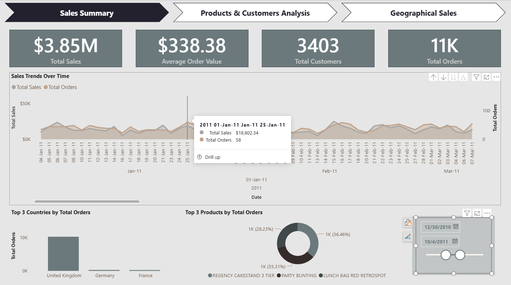
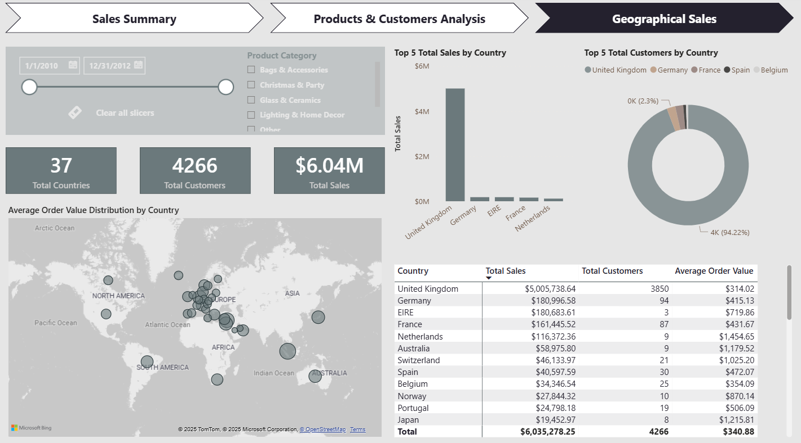
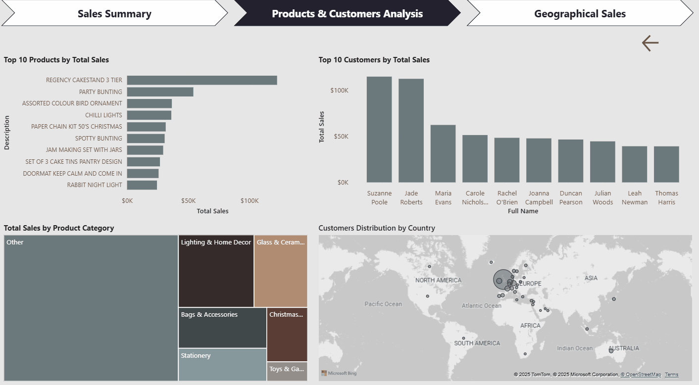

# Online Retail ETL

## Objectif du projet
Ce projet présente la création d’un pipeline ETL basé sur le jeu de données *Online Retail*.

Le projet illustre l’ensemble du cycle de vie d’un pipeline de données — de l’extraction et du nettoyage des données brutes jusqu’au chargement et à la création d’un tableau de bord interactif dans **Power BI**.


## Technologies utilisées
- Python
- Pandas
- NumPy
- Seaborn / Matplotlib
- Faker
- SQAlchemy
- Jupyter Notebook
- Power BI Desktop


## Description du dataset
Chen, D. (2015). Online Retail [Dataset]. UCI Machine Learning Repository. https://doi.org/10.24432/C5BW33.
This dataset is licensed under a Creative Commons Attribution 4.0 International (CC BY 4.0) license.


## Étapes réalisées
- Nettoyage et validation des données  
- Création de nouvelles variables (**feature engineering**)  
- Création d’une base de données (**mini data warehouse**)  
- Visualisation interactive dans Power BI  

## Instructions pour exécuter le notebook
1. Cloner le repo :
```bash
git clone https://github.com/anbialek/OnlineRetail.git
```
2. Installer les dépendances :
```bash
pip install -r requirements.txt
```
3. Ouvrir le notebook :
```bash
jupyter notebook notebooks/01_etl_pipeline.ipynb
```
---

### 🇬🇧 Summary (for non-French readers)

This project simulates an ETL process, covering:
- Data cleaning and validation
- Feature creation
- Dataset preparation by splitting into fact and dimension tables
- Building a mini data warehouse in SQLite
- Connecting it with Power BI for interactive reporting

---

##  Rapport Power BI — Online Retail
Le rapport interactif Power BI permet d’explorer :
- les comportements des clients
- les tendances globales de vente
- les caractéristiques des produits

Il se compose de 3 pages :
- Overview – KPIs principaux
- Products & Customers Analysis – caractéristiques produit et comportement client
- Geographical Sales – tendances de vente et répartition géographique

## Instructions pour ouvrir le rapport
1. Télécharger **Power BI Desktop** : [https://powerbi.microsoft.com/desktop/](https://powerbi.microsoft.com/desktop/)
2. Ouvrir le fichier `OnlineRetail.pbix`
3. Les visuels sont entièrement interactifs

## Présentation du projet




Une courte démonstration du rapport a été enregistrée à l’aide de **ScreenToGif** afin d’illustrer les interactions dans Power BI.
|  |  |

---

### 🇬🇧 Summary (for non-French readers)

This Power BI dashboard provides an interactive exploration of online retail data.
It highlights customer behavior, product performance, and geographic sales trends — enabling business insights and KPI tracking.